## An Access Control System Reference

This is a quick reference you can use to identify what access control system someone is using simply by looking at a reader.
Keep in mind this reference is user contributed, so information may be missing in the majority of cases. If you could contribute on GitHub, it would be appreciated.

### Readers

Image | Details | Card Technologies | Communication Interface | Countries | Further Information
----- | ------- | ----------------- | ----------------------- | --------- | ------------------ 
&nbsp; 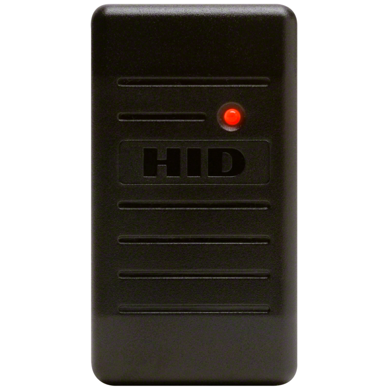 | [HID Global](https://www.hidglobal.com/)   [HID® Proximity ProxPoint® Plus 6005](https://www.hidglobal.com/products/readers/hid-proximity/6005) | 125 kHz   [HID Proximity](https://www.hidglobal.com/products/cards-and-credentials/hid-proximity) | Weigand | NZ AU | [Proxmark Commands for HID](https://scund00r.com/all/rfid/2018/06/05/proxmark-cheatsheet.html#hidproxcard)   Often contains a small branding strip replacing the HID branding in the center of the reader.   Card data is encoded in Cardax IV data format.
&nbsp; 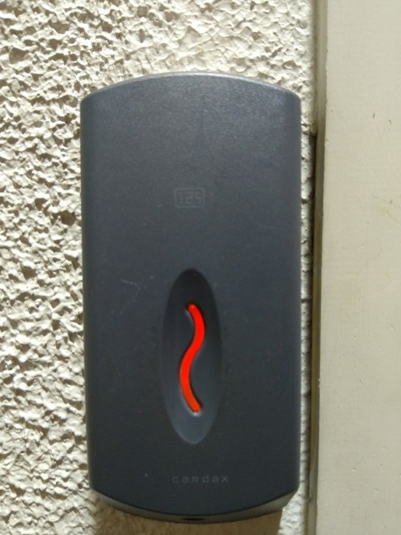 | [Cardax Prox Reader](assets/Cardax - Product List April 03.pdf)   [Cardax (Now Gallagher)](https://security.gallagher.com/) | 125 kHz   [HID Proximity](https://www.hidglobal.com/products/cards-and-credentials/hid-proximity) | Weigand | NZ AU | [Proxmark Commands for HID](https://scund00r.com/all/rfid/2018/06/05/proxmark-cheatsheet.html#hidproxcard)   Information and high resolution product images are hard to find post the rebranding to Gallagher.   Branded with "Cardax" and "125"   Card data is encoded in Cardax IV data format.
&nbsp; 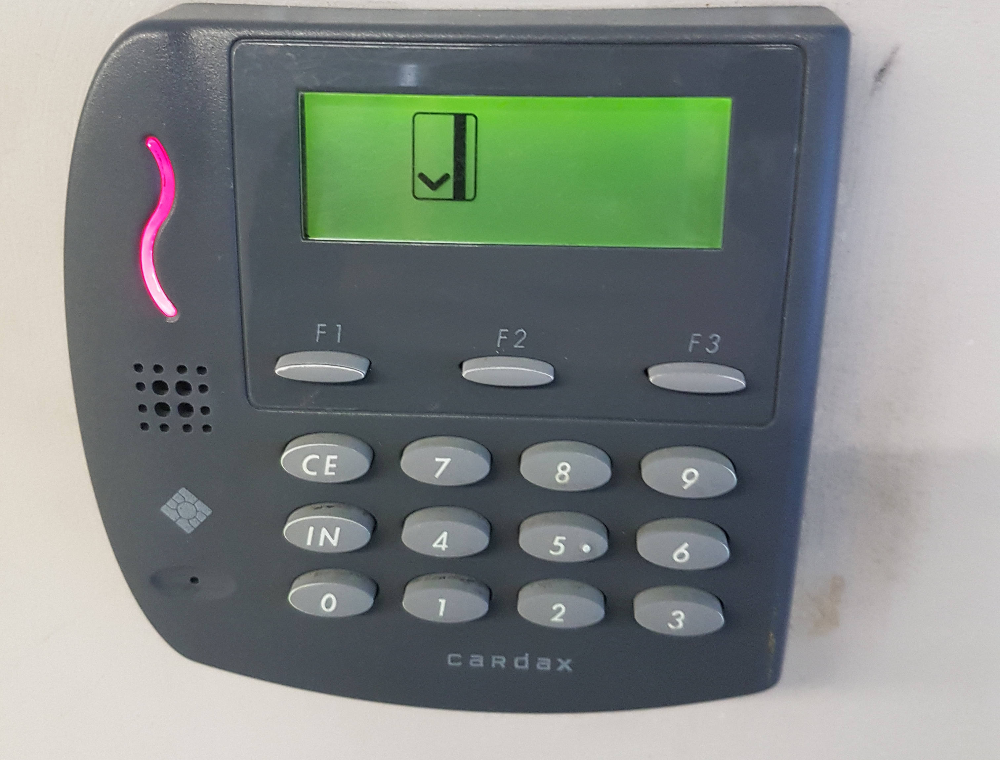 | [Cardax Prox Plus 125](https://usermanual.wiki/Gallagher-Group/19087Y/html)   [Cardax (Now Gallagher)](https://security.gallagher.com/) | 125 kHz   [HID Proximity](https://www.hidglobal.com/products/cards-and-credentials/hid-proximity) | Weigand | NZ | Information and high resolution product images are hard to find post the rebranding to Gallagher.   Card data is encoded in Cardax IV data format.
&nbsp; 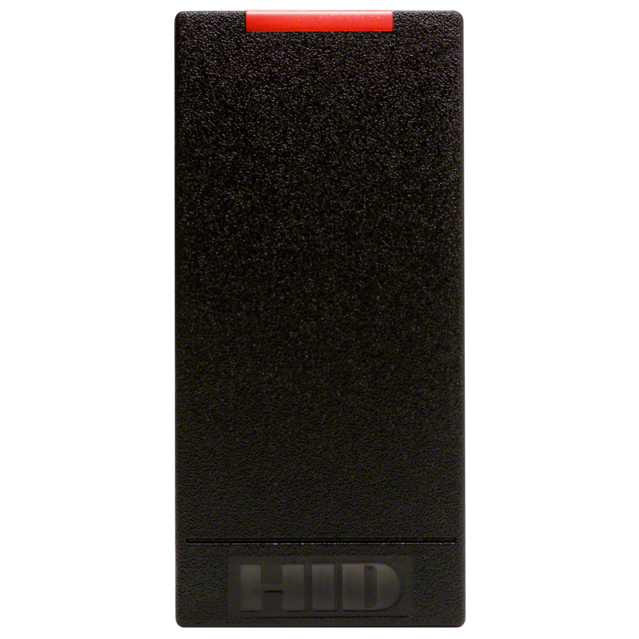 | [HID Global](https://www.hidglobal.com/)   [HID® iCLASS® RW100 Reader/Writer 6101](https://www.hidglobal.com/products/readers/iclass/rw100) | 13.56 MHz   [HID iClass](https://www.hidglobal.com/products/cards-and-credentials/iclass)   MIFARE Classic   MIFARE DESFire EV1/EV2    | Weigand | NZ AU | Very similar appearance to HID iClass SE   [Proxmark Commands for HID iClass](https://github.com/Proxmark/proxmark3/wiki/commands#hf-iclass)   [HID iClass global key](https://ss23.github.io/hid-iclass-key/)
&nbsp; 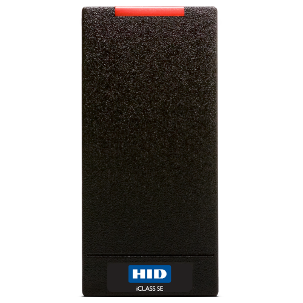 | [HID Global](https://www.hidglobal.com/)   [HID® iCLASS SE® R10](https://www.hidglobal.com/products/readers/iclass-se/r10) | 13.56 MHz   iCLASS SE   [HID iClass](https://www.hidglobal.com/products/cards-and-credentials/iclass)   [HID iClass SE](https://www.hidglobal.com/products/readers/iclass-se)   [HID iClass Seos](https://www.hidglobal.com/products/cards-and-credentials/iclass-seos)   MIFARE Classic   MIFARE DESFire EV1 | Weigand | NZ AU | Very similar appearance to HID iClass standard. May contain additional branding of "SE"   [Proxmark Commands for iClass](https://scund00r.com/all/rfid/2018/06/05/proxmark-cheatsheet.html#iclass)   [Proxmark Commands for MIFARE Classic](https://scund00r.com/all/rfid/2018/06/05/proxmark-cheatsheet.html#mifare)
&nbsp; 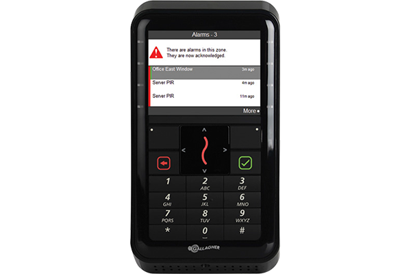 | [Gallagher Security](https://security.gallagher.com/)   [T20 - T-Series Readers](https://security.gallagher.com/products/t-series-readers) | 13.56 MHz   MIFARE Classic   MIFARE DESFire EV1/EV2   125 kHz   [HID Proximity](https://www.hidglobal.com/products/cards-and-credentials/hid-proximity)   Bluetooth | RS-485 (HBus and GBus) | NZ AU | [Proxmark Commands for MIFARE Classic](https://scund00r.com/all/rfid/2018/06/05/proxmark-cheatsheet.html#mifare)  May be used as an alarm terminal only, or access control and an alarm system   Many options may be disabled or enabled based on backwards compatibility and security requirements   Backward compatability for Cardax IV data format.   [Gallagher T-Series Information PDF](https://security.gallagher.com/assets/2523/T-Series_Reader_Datasheet.pdf)
&nbsp; 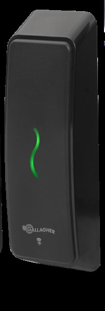 | [Gallagher Security](https://security.gallagher.com/)   [T15 - T-Series Readers](https://security.gallagher.com/products/t-series-readers) | Identical to T20 | RS-485 (HBus and GBus) | NZ AU | Identical to T20 in most aspects except alarm functionality
&nbsp; 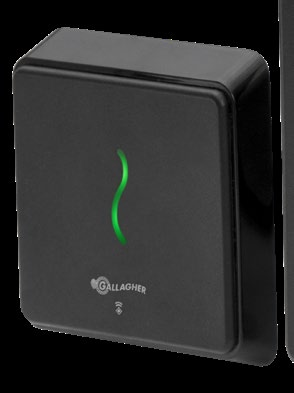 | [Gallagher Security](https://security.gallagher.com/)   [T12 - T-Series Readers](https://security.gallagher.com/products/t-series-readers) | Identical to T20 | RS-485 (HBus and GBus)  | NZ AU | Identical to T20 in most aspects except alarm functionality
&nbsp; 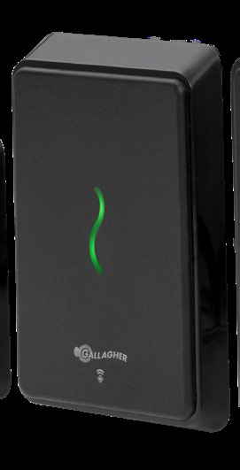 | [Gallagher Security](https://security.gallagher.com/)   [T11 - T-Series Readers](https://security.gallagher.com/products/t-series-readers) | Identical to T20 | RS-485 (HBus and GBus)  | NZ AU | Identical to T20 in most aspects except alarm functionality
&nbsp; 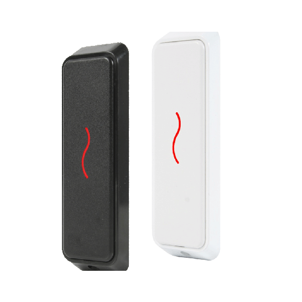 | [Gallagher Security](https://security.gallagher.com/)   [T10 - T-Series Readers](https://security.gallagher.com/products/t-series-readers) | Identical to T20 | RS-485 (HBus and GBus)  | NZ AU | Identical to T20 in most aspects except alarm functionality
&nbsp; 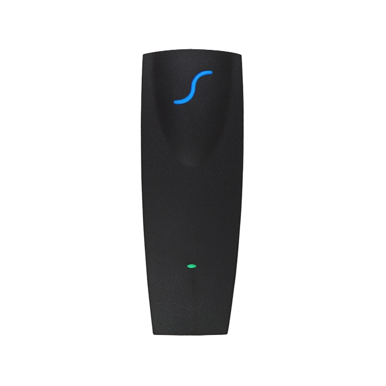 | [Paradox](http://www.paradox.com/)   [R910 (formerly DGP-R910)](http://www.paradox.com/Products/default.asp?CATID=7&SUBCATID=73&PRD=243) | 125 kHZ   Paradox | RS-485 | NZ | [Proxmark Commands for Paradox](https://github.com/Proxmark/proxmark3/wiki/commands#lf-paradox)
&nbsp; 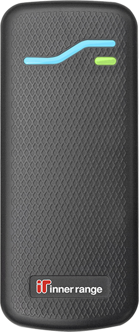 | [InnerRange SIFER RS-485](https://www.innerrange.com/pd/Card-Readers-Cards/Integriti-Readers/SIFER-Reader) | 13.56 Mhz   MIFARE DESFire EV1/EV2 | RS-485   Weigand | NZ | 
&nbsp; 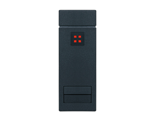 | [HID Indala](https://www.hidglobal.com/products/readers/indala/603) | 125 kHz   [FlexSecur](https://www.hidglobal.com/sites/default/files/indala-flexsecur-wp-en.pdf) | Weigand | NZ | [Proxmark Commands](https://scund00r.com/all/rfid/2018/06/05/proxmark-cheatsheet.html#indala)
&nbsp; 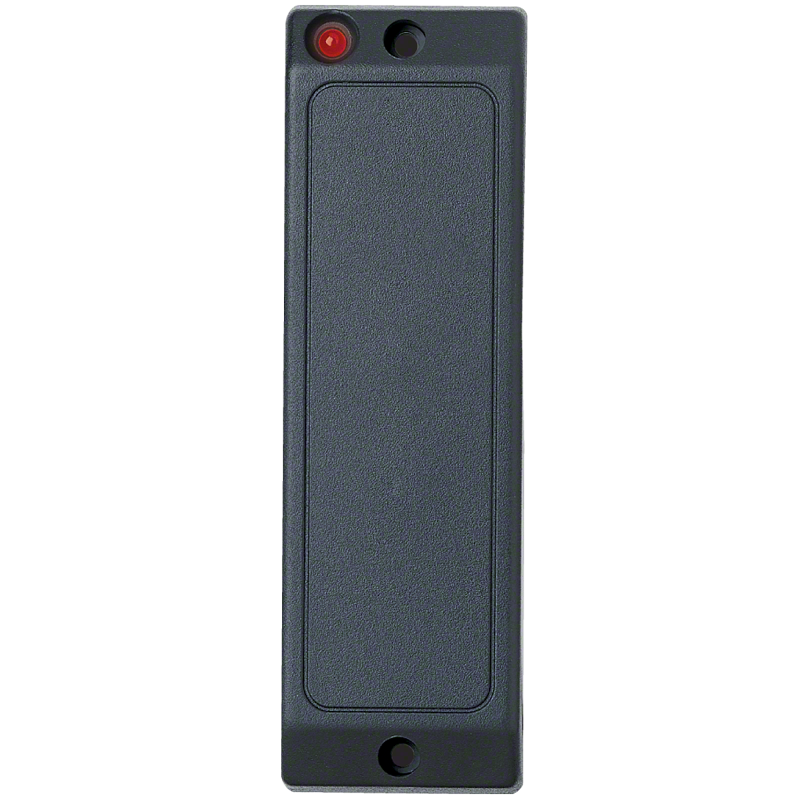 | [HID Indala Mullion SlimLine](https://www.hidglobal.com/products/readers/indala/asr-503) | 125 kHz   [FlexSecur](https://www.hidglobal.com/sites/default/files/indala-flexsecur-wp-en.pdf)| Weigand | NZ | [Proxmark Commands](https://scund00r.com/all/rfid/2018/06/05/proxmark-cheatsheet.html#indala)
&nbsp; 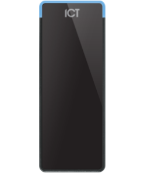 | [ICT TSEC](https://www.ict.co/TSEC-Standard-Card-Reader) | 13.56 Mhz   MIFARE DESFire EV1/EV2   125 kHz | RS-485   Weigand | NZ AU | Some models may have a keypad.
&nbsp; 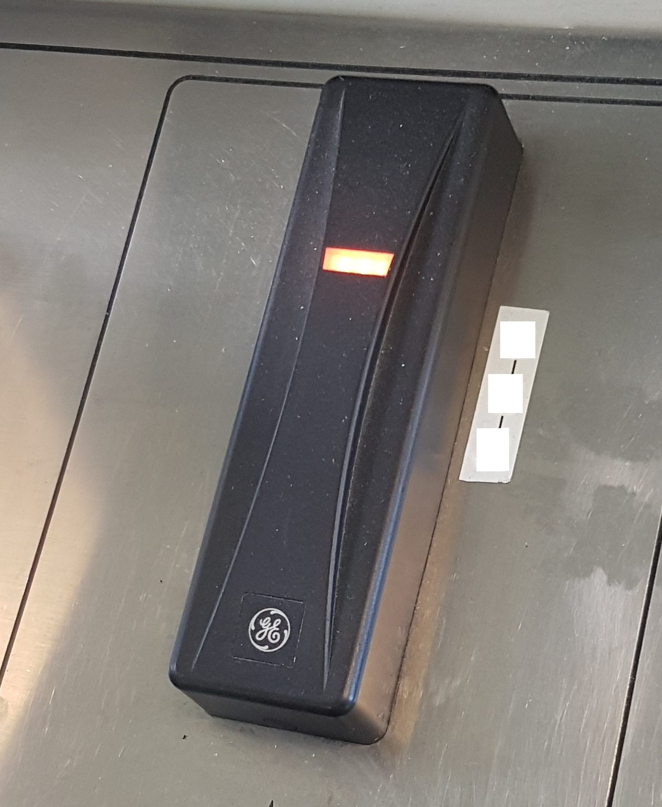 | GE (General Electric) | Unknown | Unknown | AU | 
&nbsp; 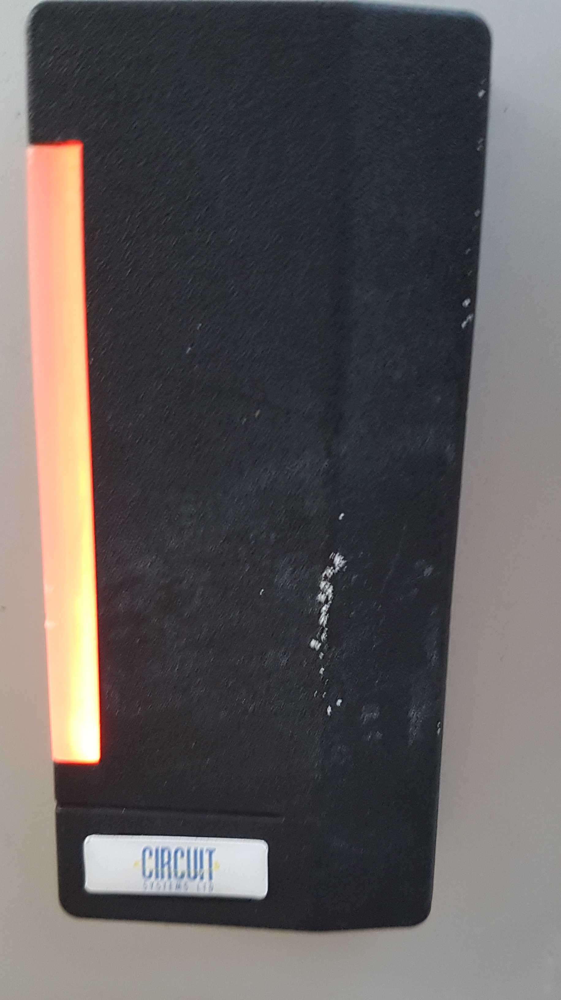 | GE (General Electric) | Unknown | Unknown | NZ | 
&nbsp; 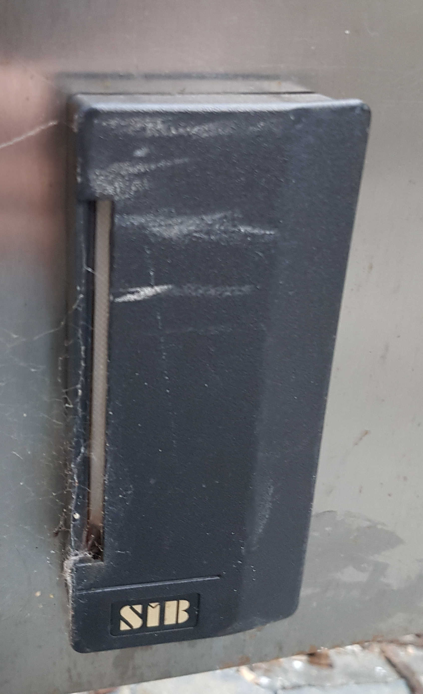 | GE (General Electric) | Unknown | Unknown | NZ | 

### Contributing

Any contributions, especially making the front-end nicer or information on access control systems in your country, are much appreciated. Please send a pull request on GitHub and the website will be updated automatically when the information is merged.
